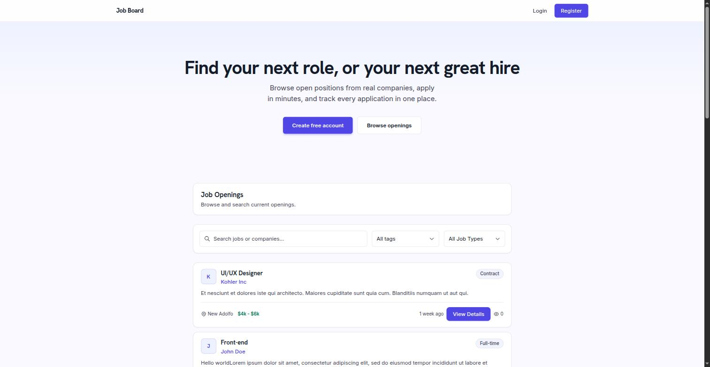
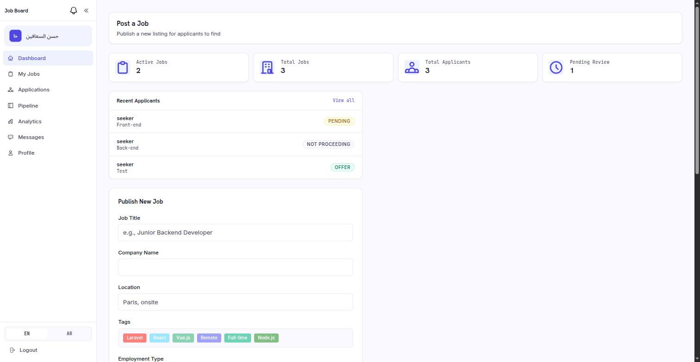
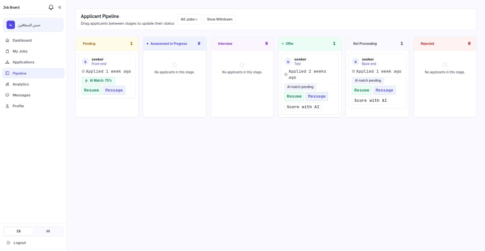
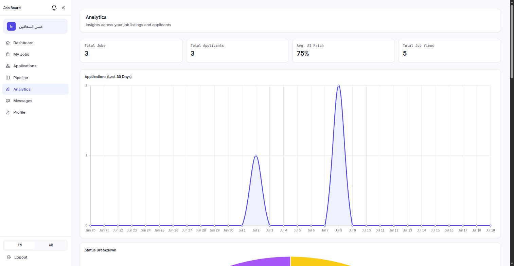
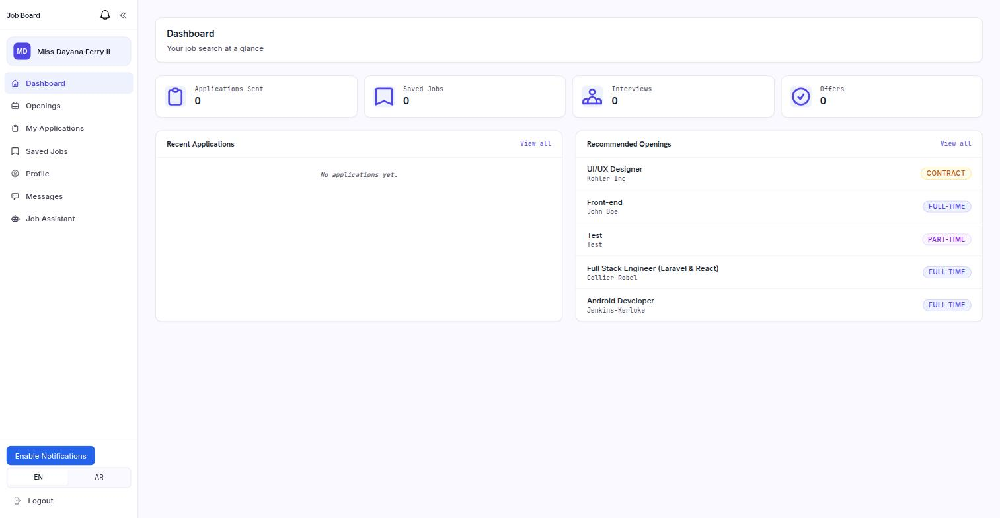
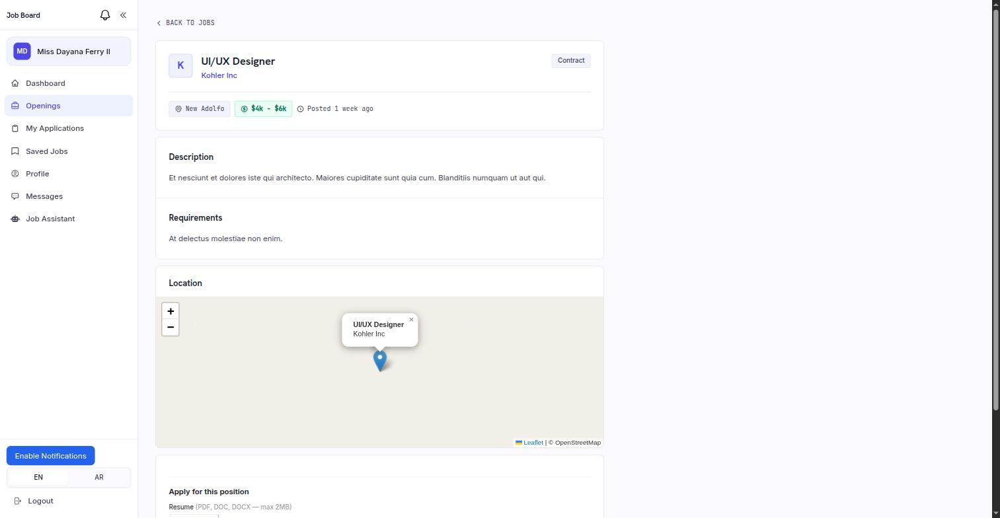
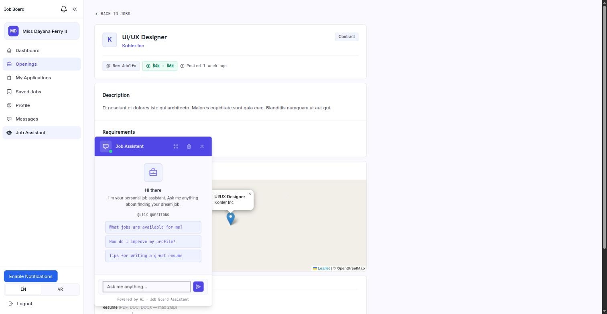
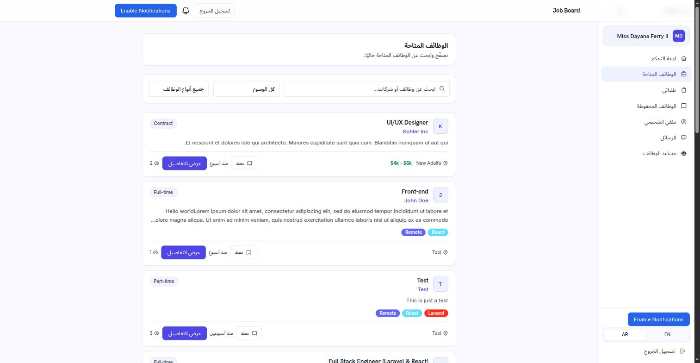
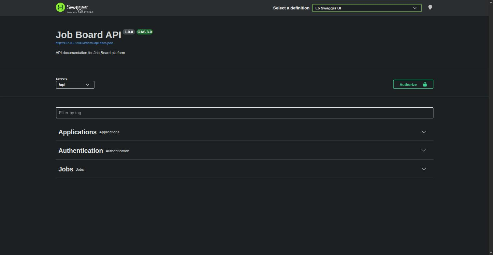

# Job Board

A full-stack job board platform built with **Laravel 13** and **Livewire 3**, featuring AI-powered resume matching, a real-time applicant pipeline, in-app messaging, push notifications, and full English/Arabic (RTL) localization.



## Features

### For Job Seekers
- Browse and search job openings by keyword, tag, or job type
- Apply with a resume (PDF/DOC/DOCX) and cover letter
- Track application status (Pending, Interview, Offer, Rejected, etc.)
- Save jobs for later and manage a personal profile
- **AI Job Assistant** — a Gemini-powered chatbot that answers questions about job matches, resume tips, and profile improvements
- Real-time direct messaging with employers
- Web push notifications for application updates

### For Employers
- Post and manage job listings with tags, salary range, and location (map preview via Leaflet/OpenStreetMap)
- **Applicant Pipeline** — drag-and-drop kanban board to move candidates through hiring stages
- **AI Resume Matching** — automatic scoring of candidate resumes against job requirements, with strengths/gaps analysis
- **Analytics dashboard** — applications over time, status breakdown, and job view counts
- Manage company profile and custom tags

### Platform
- Role-based access (Seeker / Employer / Admin) with dedicated dashboards
- Admin panel for managing users, jobs, applications, and tags
- Full English & Arabic localization with RTL layout support
- REST API with interactive Swagger/OpenAPI documentation
- Queued background jobs (e.g. async resume match scoring)

## Screenshots

| | |
|---|---|
| **Employer Dashboard** | **Applicant Pipeline** |
|  |  |
| **Analytics** | **Seeker Dashboard** |
|  |  |
| **Job Detail (with map)** | **AI Job Assistant** |
|  |  |
| **Arabic / RTL Support** | **API Documentation (Swagger)** |
|  |  |

## Tech Stack

- **Backend:** PHP 8.3+, Laravel 13
- **Frontend:** Livewire 3, Tailwind CSS 4, Vite
- **Admin:** Filament 3
- **Auth:** Laravel Fortify (2FA, passkeys), Sanctum
- **Real-time:** Laravel Reverb (WebSockets), web push notifications
- **AI:** Google Gemini API (chatbot + resume matching)
- **Docs:** L5 Swagger (OpenAPI 3.0)
- **Database:** SQLite (default), MySQL/PostgreSQL supported
- **Testing:** Pest 4

## Getting Started

### Prerequisites
- PHP 8.3+
- Composer
- Node.js & npm
- SQLite (or MySQL/PostgreSQL)

### Installation

```bash
# Clone the repository
git clone <repository-url>
cd Job_Board

# Install PHP dependencies
composer install

# Install JS dependencies
npm install

# Copy environment file and generate app key
cp .env.example .env
php artisan key:generate

# Create the SQLite database
touch database/database.sqlite

# Run migrations and seed sample data
php artisan migrate --seed
```

Add your Gemini API key to `.env` to enable the AI chatbot and resume matching features:

```env
GEMINI_API_KEY=your-api-key
GEMINI_MODEL=gemini-2.5-flash
```

### Running the app

```bash
# Build frontend assets
npm run dev    # or `npm run build` for production

# Serve the application
php artisan serve
```

Visit `http://localhost:8000`.

### API Documentation

Interactive Swagger docs are available at `/api/documentation` once the app is running.

### Running Tests

```bash
php artisan test
```

## Project Structure

```
app/
├── Livewire/               # Livewire components (seeker, employer, admin views)
├── Models/                 # Eloquent models (JobListing, Applications, User, Tag, ...)
├── Services/                # Business logic (resume matching, chatbot, analytics)
├── Jobs/                     # Queued jobs (e.g. async resume scoring)
└── Http/Middleware/          # Role-based access control (seeker/employer/admin)
resources/views/livewire/     # Blade views for Livewire components
lang/                          # English & Arabic translations
```

## License

MIT
